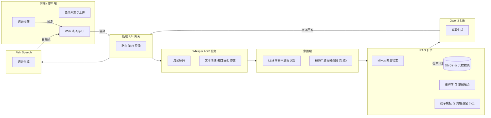
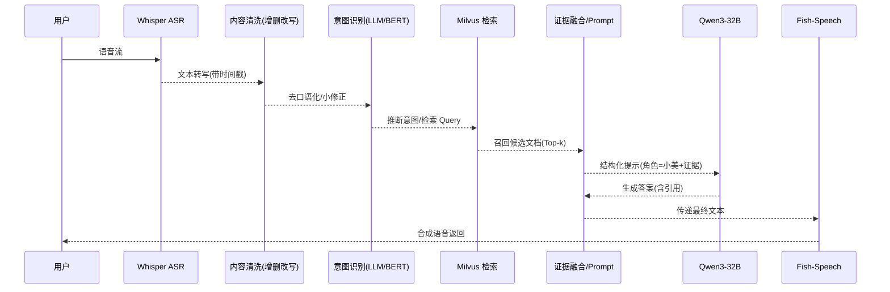

# 校园助手（小美）——模型部署与后端设计

> 面向集美大学的语音对话式校园助手，集 **Whisper ASR**（语音识别）+ **RAG**（检索增强生成）+ **Qwen3‑32B**（大语言模型）+ **Fish‑Speech**（TTS）于一体，可逐步演进到指令/工具调用与细分任务的微调形态。

------

## 一、系统总览

### 🎯 目标

- 支持 **语音唤醒 → 语音识别 → RAG 检索 → 大模型生成 → 语音合成** 的端到端闭环。
- 第一版通过 **Prompt 赋予角色设定（校园助手：小美）**，后续逐步支持 **领域微调** 与 **专用意图分类器（BERT）**。

### 🏗️ 架构图（Mermaid）



------

## 二、RAG 工作流



### RAG 组件说明

- **增删改写**：去除“呃/啊/你知道吗”等口语化；数词日期规范化；敏感信息掩码。
- **意图识别**：v1 走 **LLM few‑shot**；v2 引入 **BERT 微调**（校园领域 label 集）。
- **检索召回**：Milvus IVFFLAT/HNSW；文本向量推荐 **bge‑base‑zh / jina‑embeddings‑v3**；保留原文与分段切片。
- **答案生成**：约束式提示词（角色=小美＋校园话术）；优先引用证据；缺证据时要求澄清。

------

## 三、接口设计（v1 草案）

### 1) 语音唤醒接口

- `POST /v1/wake`
   **Body**：`{ "device_id": "str", "ts": 173757... }`
   **Resp**：`{ "ok": true, "session_id": "uuid" }`

### 2) 语音识别接口（流/分片）

- `POST /v1/asr/stream`
   **Header**：`Content-Type: audio/pcm` 或 `audio/webm`
   **Query**：`?lang=zh&session_id=uuid`
   **Resp(流)**：ASR 中间转写 + 最终文本（带时间戳）。

### 3) 大模型调用接口（文本问答）

- `POST /v1/llm/ask`
   **Body**：

```json
{
  "query": "教务处本周考试安排？",
  "user_id": "u123",
  "session_id": "uuid",
  "need_rag": true,
  "top_k": 5
}
```

**Resp**：

```json
{
  "answer": "本周考试安排见教务处公告...",
  "citations": [
    {"doc_id":"kb:notice:2025-09-20","score":0.83}
  ],
  "latency_ms": 1240
}
```

### 4) 大模型输出接口（推送/回调）

- `POST /v1/llm/callback`（可选）
   用于服务端向前端/第三方系统推送生成结果（WebHook）。

### 5) 语音合成（TTS）接口

- `POST /v1/tts/synthesize`
   **Body**：

```json
{ "text": "同学你好~我是小美...", "voice": "xiao_mei", "format": "mp3" }
```

**Resp**：二进制音频流 / 临时 URL。

> 鉴权建议：API Key / Bearer Token；对流式接口配合签名与时效校验。

------

## 四、数据与存储

### RAG 数据库表（建议）

- `kb_documents`：原文、来源、作者、时间、URL、版本、哈希
- `kb_chunks`：文档切片（chunk_id, doc_id, text, token_len, window_idx）
- `kb_vectors`：向量（chunk_id, model, dim, vector, norm）
- `kb_meta`：标签（院系、课程、公告类型、学期）
- `logs_queries`：用户查询、意图、检索参数、延迟
- `logs_serving`：ASR/LLM/TTS 调用日志与错误码

### 切片与检索建议

- **切片长度**：`512–1024` 字符 + **滑窗重叠** `~15%`
- **索引**：Milvus HNSW（小库）/IVF‑Flat（大库）
- **重排序**：BM25 × 语义分数混排；或用 **bge‑reranker‑large**

------

## 五、环境配置

### 安装 Conda（Miniforge）

```bash
wget https://github.com/conda-forge/miniforge/releases/latest/download/Miniforge3-Linux-x86_64.sh
chmod +x Miniforge3-Linux-x86_64.sh
bash Miniforge3-Linux-x86_64.sh -b -p ~/miniforge3
# 若未自动初始化：
~/miniforge3/bin/conda init
# 或手动：
echo 'export PATH="$HOME/miniforge3/bin:$PATH"' >> ~/.bashrc
source ~/.bashrc
conda --version
```

### 创建环境（ASR/RAG 基础）

```bash
conda create -n funasr python=3.10 -y
conda activate funasr
# 依据实际框架补充：torch/torchaudio/transformers/milvus/bge 等
```

> 说明：Whisper、Fish‑Speech、Qwen3‑32B 与 vLLM/CUDA 的具体版本需结合所租用 GPU/驱动匹配，详见各组件 README。

------

## 六、Prompt 角色设定（v1）

> 作为集美大学校园助手“小美”，你：

- 语气亲切，提供准确信息，优先引用校内权威来源；
- 未检索到权威证据时，先澄清再回答；
- 输出格式：**先结论**→证据要点→可选链接/去向；
- 涉及时间安排一律给出**绝对日期**（如 2025‑09‑22）。

------

## 七、Roadmap / TODO

-  收集用户问题样本（≥1k 条，覆盖考试/选课/宿舍/后勤等）
-  收集优质问答对（构建领域 QA 基础库）
-  设计并落地存储表结构（上节 Schema）
-  数据入库与索引构建（Milvus）
-  完成 v1 API（本页接口），联调前端
-  意图识别：从 LLM few‑shot 过渡到 BERT 微调
-  引入重排序器（bge‑reranker）
-  评测集与指标：ASR WER、检索 Recall@k、LLM QA EM/F1、端到端延迟

------

## 八、开发与调试建议

- 打通 **链路日志**：请求 ID 贯穿 ASR → RAG → LLM → TTS；
- 关键指标埋点：ASR WER、检索耗时、模型生成时延、TTS 时延；
- 兜底策略：检索 < 阈值时改为澄清/引导；
- 安全合规：敏感词/个人信息脱敏，接口鉴权与频控。

------

## 九、目录建议（示例）

```
repo/
├─ README.md
├─ api/
│  ├─ openapi.yaml
│  └─ examples/
├─ services/
│  ├─ asr-whisper/
│  ├─ rag/
│  ├─ llm-qwen/
│  └─ tts-fishspeech/
├─ configs/
│  ├─ rag.yaml
│  └─ milvus.yaml
└─ scripts/
   ├─ env_setup.sh
   └─ run_all.sh
```

------

## 十、贡献与许可

- 欢迎提交 Issue/PR，讨论校园领域数据建设与评测方法。
- 许可证：MIT（可按实际需要调整）。