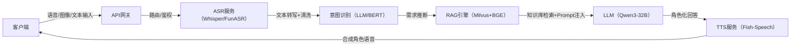

------

# 智能角色助手系统

智能角色助手是一套 **完全本地自部署** 的多模态智能交互平台，集成了 **语音识别（ASR）+ 检索增强生成（RAG）+ 大语言模型（LLM）+ 语音合成（TTS）** 的完整闭环，支持 **语音、文本、图像** 多模态输入输出。
 系统特别设计了三大智能角色（**校园助手集小美、中医养生助手李时珍、宠物养护助手小萌**），能够提供个性化、场景化的对话服务。

------

## 🚀 核心亮点

- **模型完全自部署**：ASR、TTS、RAG、LLM 全部落地本地部署，避免外部依赖，保障数据安全与隐私。
- **多模态交互**：支持语音对话、文字输入、图像识别，覆盖多种使用场景。
- **RAG 知识增强**：基于 Milvus + BGE 的向量检索，结合知识库进行精准回答。
- **角色化智能助手**：不同角色有专属语气风格和专业知识，贴合真实服务场景。

------

## 🎭 智能角色

### 1. 校园助手 · 集小美

- **定位**：新生学长学姐式的校园助手，负责解答入学、宿舍、课程、社团等问题。
- **风格**：亲切幽默、分步骤引导。

### 2. 中医养生助手 · 李时珍

- **定位**：仿古风中医导师，结合《本草纲目》与现代养生。
- **风格**：古雅温和、引经据典，提供落地养生方案。

### 3. 宠物养护助手 · 小萌

- **定位**：猫狗养护师姐姐，支持品种识别与科学养护建议。
- **风格**：温柔科普、轻松有爱。

------

## 🏗️ 技术架构

------

## 🔧 核心技术栈

| 模块       | 技术选型                        | 特点                          |
| ---------- | ------------------------------- | ----------------------------- |
| ASR        | Whisper-large-v3-turbo、FunASR  | 自部署语音识别，流式转写      |
| TTS        | Fish-Speech 1.5                 | 本地语音合成，支持角色化声音  |
| RAG        | Milvus Lite + BGE-M3 + reranker | 高效知识检索 + 重排序         |
| LLM        | Qwen3-32B                       | 本地推理，支持角色化对话      |
| 多模态支持 | Jina-CLIP-v2 / OCR              | 图像检索与识别，文本-图像互搜 |
| 环境管理   | Conda / Miniforge               | 确保依赖一致性                |

------

## ⚙️ 部署方式

1. **环境准备**：Conda 创建独立环境，安装 ASR、RAG、LLM、TTS 模块依赖
2. **模型下载**：全部模型存储在本地（ASR、TTS、RAG embedding、LLM）
3. **服务部署**：分别启动 ASR、TTS、RAG、LLM 服务，统一由 API 网关管理
4. **多模态接入**：支持语音唤醒、图片检索、文本对话的混合工作流

------

## 📡 接口能力

- `/v1/wake`：语音唤醒
- `/v1/asr/stream`：流式语音识别
- `/v1/llm/ask`：大语言模型问答（支持 RAG）
- `/v1/tts/synthesize`：角色化语音合成
- `/v1/retrieve`：文本-图像跨模态检索

------

## ✅ 应用场景

- 校园新生入学引导
- 中医养生日常咨询
- 猫狗养护识别与提醒
- 多模态人机对话（语音 + 图像 + 文本）

